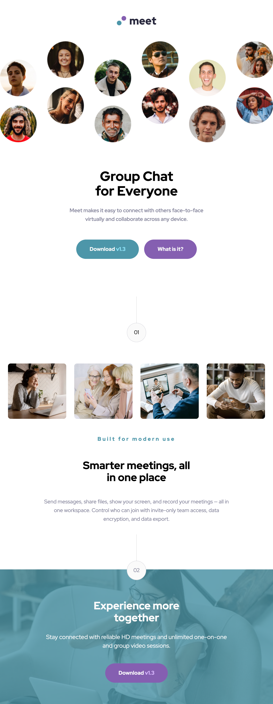
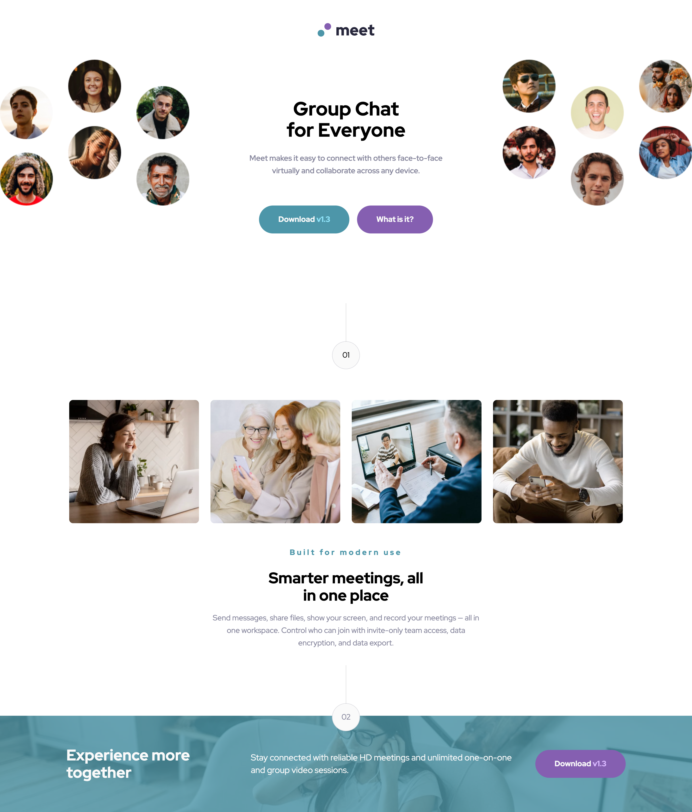

# Frontend Mentor - Meet landing page solution

This is a solution to the [Meet landing page challenge on Frontend Mentor](https://www.frontendmentor.io/challenges/meet-landing-page-rbTDS6OUR). Frontend Mentor challenges help you improve your coding skills by building realistic projects.

## Table of contents

- [Overview](#overview)
  - [The challenge](#the-challenge)
  - [Screenshot](#screenshot)
  - [Links](#links)
- [My process](#my-process)
  - [Built with](#built-with)
  - [What I learned](#what-i-learned)
  - [Continued development](#continued-development)
  - [Useful resources](#useful-resources)
- [Author](#author)

## Overview

### The challenge

Users should be able to:

- View the optimal layout depending on their device's screen size
- See hover states for interactive elements

### Screenshot

### Links

- Solution URL: [https://github.com/cwwittor/meet-landing-page](https://github.com/cwwittor/meet-landing-page)
- Live Site URL: [https://meet-landing-page-bs4.pages.dev/](https://meet-landing-page-bs4.pages.dev/)

## My process

### Built with

- Semantic HTML5 markup
- CSS custom properties
- Flexbox
- CSS Grid
- Mobile-first workflow

### What I learned

- The thing I had taken away most from this project was planning out design at multiple designs with a mobile first focus. Seeing how the different images would change each iteration was a little tought to think about initially but I am thankful they gave a lot of assets for this. Things like decerning grid and flex was also important too.

### Continued development

In future projects the thing I want to focus on is getting to this finished product faster and I think I can do that through practicing more.

### Useful resources

- I had asked some small simple formatting questions to raycast ai when I had wanted to make sure on some commands.

## Author

- Frontend Mentor - [@cwwittor](https://www.frontendmentor.io/profile/cwwittor)
